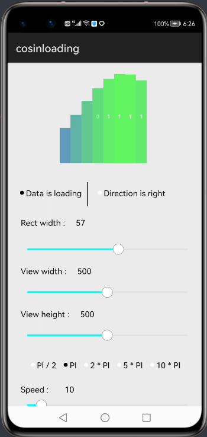
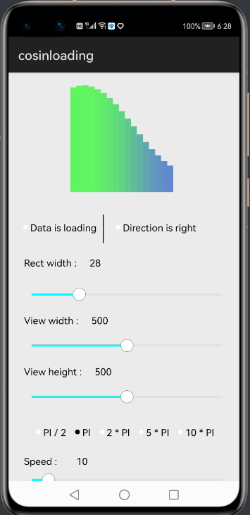
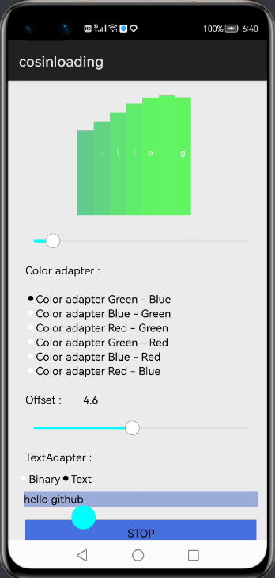
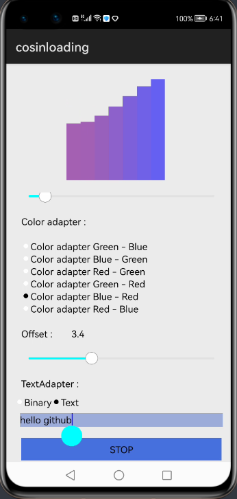
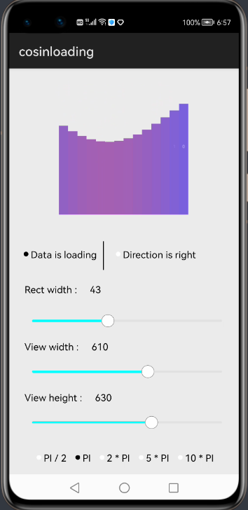

<p align="center">
	<h2 align="center""><b><font size="36">COSIN</font></b></h2>
	<h4 align="center">Loading android view lib</h4>
</p>
			  
<p align="center">
	
	
	
</p>
<p align="center">
	
	
	
</p>
							
## Source
This library is inspired by the [Cosin](https://github.com/NikitaGordia/Cosin) library version 1.1.0

## Dependency
1. For using Cosin module in sample app, include the source code and add the below dependencies in entry/build.gradle to generate hap/cosin.har.
```java
dependencies {
    implementation project(':cosin')
    implementation fileTree(dir: 'libs', include: ['*.har'])
    testCompile 'junit:junit:4.12'
}
```
2. For using Cosin in separate application using har file, add the har file in the entry/libs folder and add the dependencies in entry/build.gradle file.
```java
dependencies {
    implementation fileTree(dir: 'libs', include: ['*.har'])
    testCompile 'junit:junit:4.12'
}
```

## Features
## Properties

| Property    						    | Description   																					        |
| --------------------------------------|-----------------------------------------------------------------------------------------------------------|
| speed     							| Angle speed		  																						|
| isLoading    							| If 'true' shows symbols on rectangle		  																|
| setEnd    							| Shows end animation (optionally you may pass onEnd(OnEnd))
| rectWidth    							| Width each of rectangle 					  																|
| period    							| Determine period of cosinusoidal function																	|
| colorAdapter    						| Define color changes by two parameters (position count, height percent) for each rectagle					|
| offset    							| Moving bottom offset																						|
| directionRight    					| Determine movement side																					|
| textAdapter    						| Define text changes by position count for each rectangle													|


## Usage
## Declaration

```xml
<com.nikitagordia.cosin.Cosin
        ohos:height="130vp"
        ohos:width="270px" />
```

## There are 6 default ColorAdapter implementation in box :

* DefaultColorAdapterGb (Green -> Blue)
* ColorAdapterBg (Blue -> Green)
* ColorAdapterBr (Blue -> Red)
* ColorAdapterGr (Green -> Blue)
* ColorAdapterRb (Red -> Blue)
* ColorAdapterRg (Red -> Green)


## There are 2 default TextAdapter implementation in box :

* DefaultBinaryTextAdapter (shows random [0, 1] symbols in each rectagle)
* WordTextAdapter (shows specified cycle String)


#### ColorAdapter overriding example :
```java
public class ColorAdapterBr implements Cosin.ColorAdapter {

    @Override
    public int getBackgroundColor() {
        return Color.TRANSPARENT.getValue();
    }

    @Override
    public int calcColor(int numOfRect, double percentOfHeight) {
        return Color.argb(150, (int) (255 * (1d - percentOfHeight)), 0, (int) (255 * percentOfHeight));
    }
}
```

#### TextAdapter overriding example :
```java
public class WordTextAdapter implements Cosin.TextAdapter {
    private String word;

    public WordTextAdapter(String word) {
        this.word = word;
    }

    @Override
    public char getString(int numOfRect) {
        if (word.isEmpty()) {
            return ' ';
        }
        return word.charAt(numOfRect % word.length());
    }
}
```
#### A bit more gifs
<p align="center">
	
	
	
	
</p>
